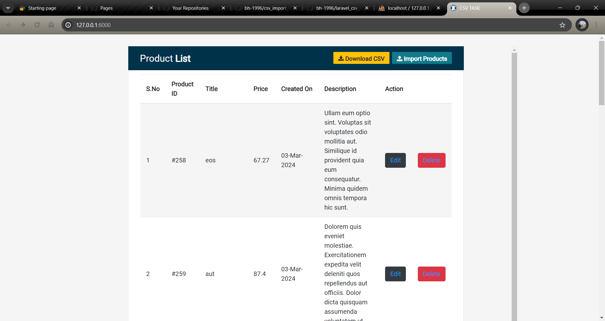

# CSV Import Laravel



## Overview

CSV Import Laravel is a Laravel application designed to facilitate the import of user data from CSV files into a Laravel-based application. It provides an easy-to-use interface and command-line tools to streamline the process of onboarding users from CSV files.

## Features

- **CSV File Parsing**
  - Efficiently parse CSV files with user data.
- **Data Validation**
  - Ensure the imported data meets the required criteria.
- **User Import**
  - Seamlessly import users into the Laravel database.
- **Error Handling**
  - Handle and report errors during the import process.
- **Data Management**
  - View and manage imported user data via Laravel's interface.

## Installation

### Prerequisites

- PHP >= 7.3
- Composer
- Laravel >= 8.x
- MySQL or other supported database

### Steps

1. **Clone the Repository**

   ```bash
   git clone git@github.com:bh-1996/csv_import_crud_laravel.git

2. **Navigate to the Project Directory**

   ```bash
   cd csv_import_crud_laravel